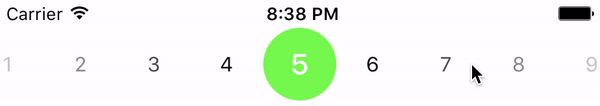

# VRPicker

[](https://travis-ci.org/vrutberg/VRPicker)
[](http://cocoapods.org/pods/VRPicker)
[](http://cocoapods.org/pods/VRPicker)
[](http://cocoapods.org/pods/VRPicker)

## Example



To run the example project, clone the repo, and run `pod install` from the Example directory first.

## Installation

VRPicker is available through [CocoaPods](http://cocoapods.org). To install
it, simply add the following line to your Podfile:

```ruby
pod "VRPicker"
```

## Usage

The `VRPicker` class is generic, and accepts one type parameter which must be a subclass of `VRPickerItem`. The type you pass in here will be your item class. `VRPicker` is instantiated with an instance of `VRPickerConfiguration` (which also accepts one type parameter), and a `CGRect` for frame:

```swift
struct PickerItem: VRPickerItem {
  let number: Int

  var description: String {
    return "\(number) yrs"
  }
}

let config = VRPickerConfiguration<PickerItem>(items: ...)
let pickerView = VRPicker<PickerItem>(with: config, frame: .zero)

pickerView.didSelectItem = { item in
  print(item)
}
```

As done in the example above, the `didSelectItem` function property should be set to receive updates about which item is currently selected.

### Configuration

`VRPickerConfiguration`, which is used when instantiating an instance of `VRPicker`, holds the various properties which can be configured.

All configuration properties have default values.

#### `items: [T]` (no default value)

The list of items to display in the picker. The items must conform to the protocol `VRPickerItem`, which extends `CustomStringConvertible`.

#### `defaultSelectedIndex: Int` (default value: `0`)

Which index should be selected when the picker is initialized.
    
#### `selectedFont: UIFont` (default value: `UIFont.boldSystemFont(ofSize: 20)`)

Which font to use for the currently selected item.

#### `selectedFontColor: UIColor` (default value: `UIColor.white`)

Which font color to use for the currently selected item.

#### `nonSelectedFont: UIFont` (default value: `UIFont.systemFont(ofSize: 14)`)

Which font to use for the non-selected items.

#### `nonSelectedFontColor: UIColor` (default value: `UIColor.black`)

Which font color to use for the non-selected items.

#### `selectionRadiusInPercent: Double` (default value: `0.3`)

The radius of the selection circle, in percent. (1.0 = 100 %)

#### `selectionBackgroundColor: UIColor` (default value: `UIColor.green`)

Which background color to use for the selection circle.
    
#### `gradientColors: [UIColor]` (default value: `[UIColor.white.withAlphaComponent(0.8), UIColor.white.withAlphaComponent(0)]`)

An array of gradient colors to use for the left and right sides.

#### `gradientWidthInPercent: Double` (default value: `0.4`)

The gradient width, in percent, of the entire picker width. (1.0 = 100 %)

#### `gradientPosition: GradientPosition` (default value: `GradientPosition.above`)
  
Which position to use for the gradients, above or below the items.

#### `itemWidth: Int` (default value: `100`)

Which width, in points, to use for the items.

#### `sliderVelocityCoefficient: Double` (default value: `60`)

Velocity coefficient for the scroll views.

## Author

Viktor Rutberg, wishie@gmail.com

## License

VRPicker is available under the MIT license. See the LICENSE file for more info.
